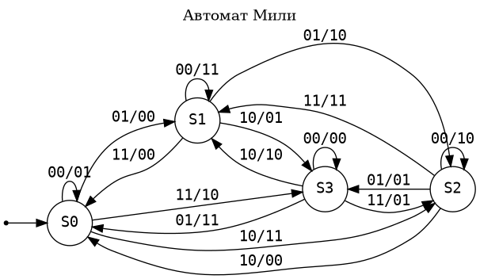

# Автомат Мили

## Алфавиты

Вход x = {00, 01, 10, 11}

Выход y = {00, 01, 10, 11}

## Диаграмма состояний

|               | x=00    | x=01    | x=10    | x=11    |
| :-----------: | :------ | :------ | :------ | :------ |
|       S0      | S0 / 01 | S1 / 00 | S2 / 11 | S3 / 10 |
|       S1      | S1 / 11 | S2 / 10 | S3 / 01 | S0 / 00 |
|       S2      | S2 / 10 | S3 / 01 | S0 / 00 | S1 / 11 |
|       S3      | S3 / 00 | S0 / 11 | S1 / 10 | S2 / 01 |

